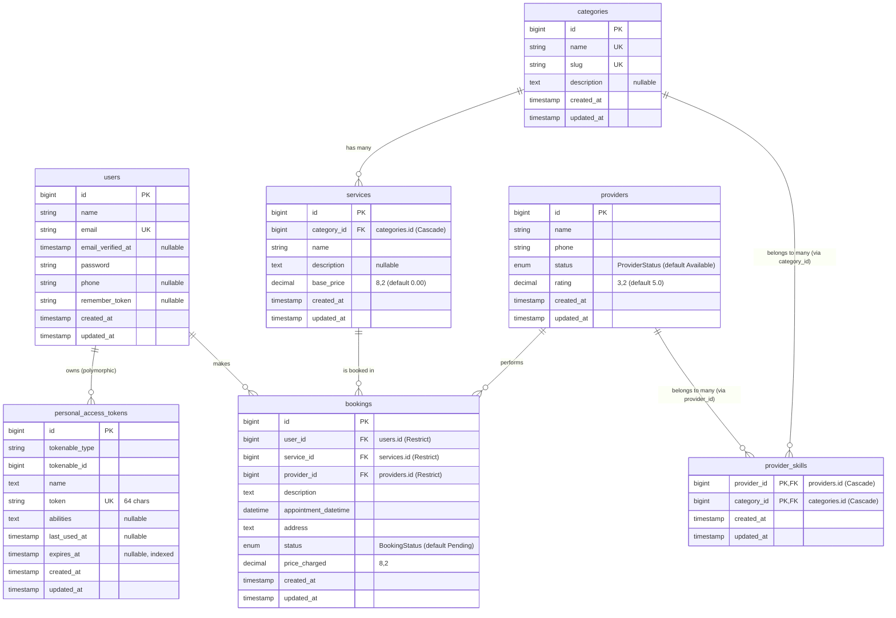

# HomeEase Database Entity Relationship Diagram (ERD)

เอกสารนี้แสดงโครงสร้างฐานข้อมูล (Entity Relationship Diagram - ERD) และความสัมพันธ์ของตารางต่าง ๆ ในโปรเจกต์ HomeEase ที่วิเคราะห์จากไฟล์ Database Migrations ของระบบ

---

## 1. แผนภาพ ERD (Mermaid Diagram)

---

## 2. รายละเอียดตารางและความสัมพันธ์ (Table Schema & Relationships)

### 2.1 ตารางหลัก (Core Entities)

#### 1. `users`
ตารางจัดเก็บข้อมูลผู้ใช้งาน (ลูกค้า) ในระบบ
* **Relationships**:
  * **One-to-Many (`1:N`)** กับ `bookings` (หนึ่งคนสามารถจองบริการได้หลายรายการ)
  * **Polymorphic One-to-Many (`1:N`)** กับ `personal_access_tokens` (ใช้สำหรับ API Authentication)

#### 2. `categories`
ตารางจัดเก็บหมวดหมู่ของบริการหลัก (เช่น Cleaning, Plumbing, Electrical)
* **Relationships**:
  * **One-to-Many (`1:N`)** กับ `services` (หนึ่งหมวดหมู่มีบริการย่อยได้หลายบริการ)
  * **Many-to-Many (`M:N`)** กับ `providers` ผ่านตาราง `provider_skills` (หนึ่งหมวดหมู่สามารถจับคู่กับผู้ให้บริการหลายคน)

#### 3. `services`
ตารางจัดเก็บข้อมูลบริการย่อยภายใต้หมวดหมู่
* **Relationships**:
  * **Many-to-One (`N:1`)** กับ `categories` (เชื่อมด้วย `category_id` และลบข้อมูลอัตโนมัติหากหมวดหมู่ถูกลบ - **Cascade Delete**)
  * **One-to-Many (`1:N`)** กับ `bookings` (หนึ่งบริการสามารถถูกจองได้หลายครั้ง)

#### 4. `providers`
ตารางจัดเก็บข้อมูลผู้ให้บริการ (Service Providers)
* **Relationships**:
  * **Many-to-Many (`M:N`)** กับ `categories` ผ่านตาราง `provider_skills` (หนึ่งผู้ให้บริการมีความชำนาญได้หลายหมวดหมู่)
  * **One-to-Many (`1:N`)** กับ `bookings` (หนึ่งผู้ให้บริการทำงานจองได้หลายรายการ)

---

### 2.2 ตารางเชื่อมโยงและประวัติการทำงาน (Pivot & Transactions)

#### 5. `provider_skills` (Pivot Table)
ตารางเชื่อมความสัมพันธ์แบบ Many-to-Many เพื่อระบุทักษะ/ความสามารถของผู้ให้บริการ
* **Composite Primary Key**: `(provider_id, category_id)`
* **Foreign Keys**:
  * `provider_id` เชื่อมโยงกับ `providers.id` (**Cascade Delete**)
  * `category_id` เชื่อมโยงกับ `categories.id` (**Cascade Delete**)

#### 6. `bookings`
ตารางจัดเก็บธุรกรรมการจองบริการของลูกค้า
* **Foreign Keys**:
  * `user_id` เชื่อมโยงกับ `users.id` (**Restrict Delete** ป้องกันการลบข้อมูลลูกค้าที่มีประวัติการจอง)
  * `service_id` เชื่อมโยงกับ `services.id` (**Restrict Delete**)
  * `provider_id` เชื่อมโยงกับ `providers.id` (**Restrict Delete**)
* **Important Columns**:
  * `price_charged`: ราคาสุทธิที่คิดเงินลูกค้า ณ เวลาที่จอง (เก็บบันทึกเผื่อราคาบริการหลักมีการเปลี่ยนแปลงในอนาคต)
  * `appointment_datetime`: วันเวลาที่นัดหมาย
  * `status`: สถานะของการจอง (ควบคุมด้วย `BookingStatus` Enum)

---

### 2.3 ตารางระบบและความปลอดภัย (System & Security)

#### 7. `personal_access_tokens` (Laravel Sanctum)
ตารางสำหรับเก็บ API Token ที่ออกให้กับผู้ใช้งานในการยืนยันตัวตน
* **Polymorphic Key**: `(tokenable_type, tokenable_id)` (รองรับการยืนยันตัวตนหลายรูปแบบ)
* **Unique Key**: `token` (64 ตัวอักษร)
